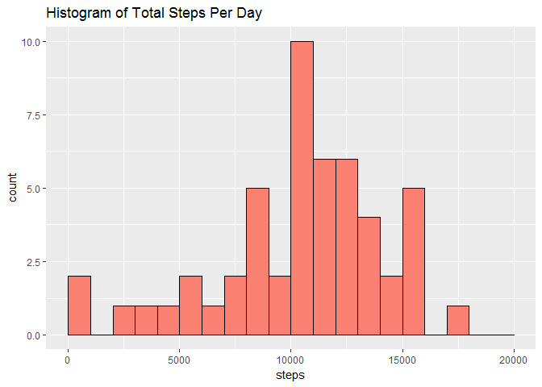
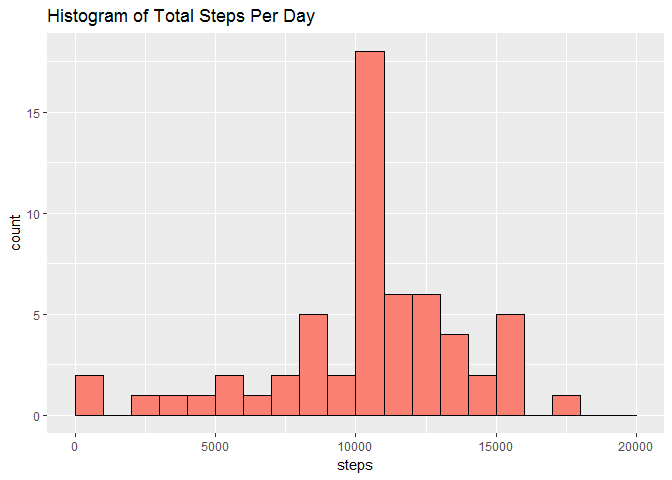
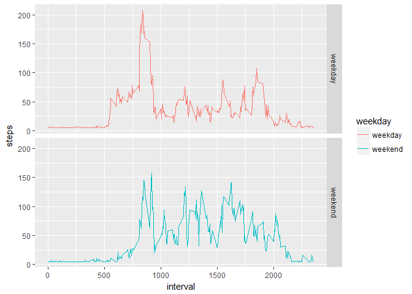

# Reproducible Research: Peer Assessment 1


# Loading and preprocessing the Data


```r
dat<-read.csv("activity.csv")
head(dat)
```

```
##   steps       date interval
## 1    NA 2012-10-01        0
## 2    NA 2012-10-01        5
## 3    NA 2012-10-01       10
## 4    NA 2012-10-01       15
## 5    NA 2012-10-01       20
## 6    NA 2012-10-01       25
```

# What is mean total number of steps taken per day?

```r
totalsteps<-aggregate(steps~date,data=dat,FUN=sum,na.rm=T)
library(ggplot2)
ggplot(totalsteps,aes(steps))+geom_histogram(breaks=seq(0, 20000, by = 1000),fill="salmon",color="black")+ggtitle("Histogram of Total Steps Per Day")
```

<!-- -->

```r
meansteps<-mean(totalsteps$steps,na.rm=T)
mediansteps<-median(totalsteps$steps,na.rm=T)
list(meansteps=meansteps,mediansteps=mediansteps)
```

```
## $meansteps
## [1] 10766.19
## 
## $mediansteps
## [1] 10765
```

# What is the average daily activity pattern?

```r
daily<-aggregate(steps~interval,data=dat,FUN=mean,na.rm=T)
ggplot(daily,aes(interval,steps))+geom_line()
```

<!-- -->

```r
daily[which.max(daily$steps),]$interval
```

```
## [1] 835
```

# Imputing missing values

```r
nrow(dat[!complete.cases(dat),])
```

```
## [1] 2304
```
There are 2304 rows with missing values. 

```r
#create new dataset to replace missingness. 
dat1<-dat
#impute mean steps in new dataset
dat1$steps<-replace(dat1$steps,is.na(dat1$steps),mean(dat1$steps,na.rm=T))
totalsteps2<-aggregate(steps~date,data=dat1,FUN=sum)
ggplot(totalsteps2,aes(steps))+geom_histogram(breaks=seq(0, 20000, by = 1000),fill="salmon",color="black")+ggtitle("Histogram of Total Steps Per Day")
```

<!-- -->

```r
meansteps2<-mean(totalsteps2$steps)
mediansteps2<-median(totalsteps2$steps)
list(meansteps=meansteps2,mediansteps=mediansteps2)
```

```
## $meansteps
## [1] 10766.19
## 
## $mediansteps
## [1] 10766.19
```
The computed median total number of steps per day is now closer to the mean. 

# Are there differences in activity patterns between weekdays and weekends?

```r
dat1$weekday<-ifelse(weekdays(as.Date(dat1$date)) %in% c("Sunday","Saturday"),"weekend","weekday")
daily2<-aggregate(steps~interval+weekday,data=dat1,FUN=mean)
ggplot(daily2,aes(interval,steps,col=weekday))+geom_line()+facet_grid(weekday~.)
```

<!-- -->

Activity patterns differ between weekday and weekends. 
